# 🎫 IT Service Desk Incident Management Lab

**osTicket · Docker · MariaDB · Windows 11 · PowerShell · GitHub**

A hands-on IT Service Desk homelab designed to demonstrate practical **Level 1 IT Support and incident management skills** using a self-hosted osTicket environment.

The project simulates a real Service Desk workflow:

> **Identify → Investigate → Troubleshoot → Resolve → Verify → Document → Close**

---

## 🎯 Project Objectives

* Deploy and configure a functional osTicket Service Desk
* Configure departments, help topics, support teams, agents, and users
* Simulate realistic IT support incidents
* Practice ticket triage and prioritization
* Perform structured first-line troubleshooting
* Document troubleshooting and resolutions
* Demonstrate professional user communication
* Practice proper ticket closure and incident documentation
* Maintain technical documentation using Git and GitHub

---

## 🛠️ Lab Environment

| Component         | Technology              |
| ----------------- | ----------------------- |
| Host OS           | Windows 11              |
| Ticketing System  | osTicket 1.18.4         |
| Deployment        | Docker / Docker Compose |
| Database          | MariaDB 10.11           |
| Linux Environment | WSL 2 / Ubuntu          |
| Scripting         | PowerShell              |
| Version Control   | Git / GitHub            |

---

# Phase 1 — Environment Setup

Built the underlying Service Desk environment using Docker and Docker Compose.

### 1. Docker Version

Verified that Docker was installed and available on the Windows environment.

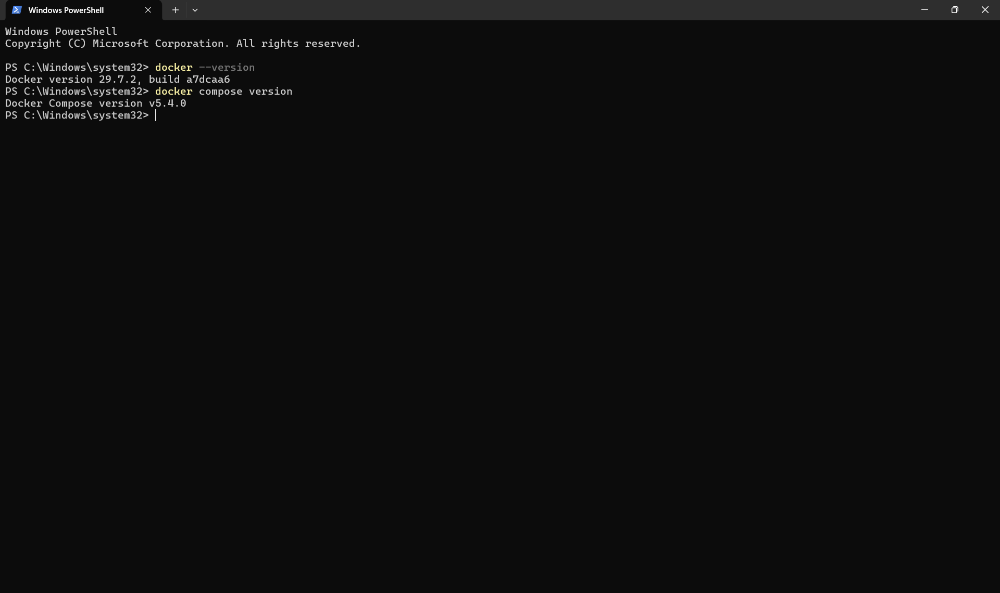

---

### 2. Docker Hello World

Verified that Docker containers could successfully run.

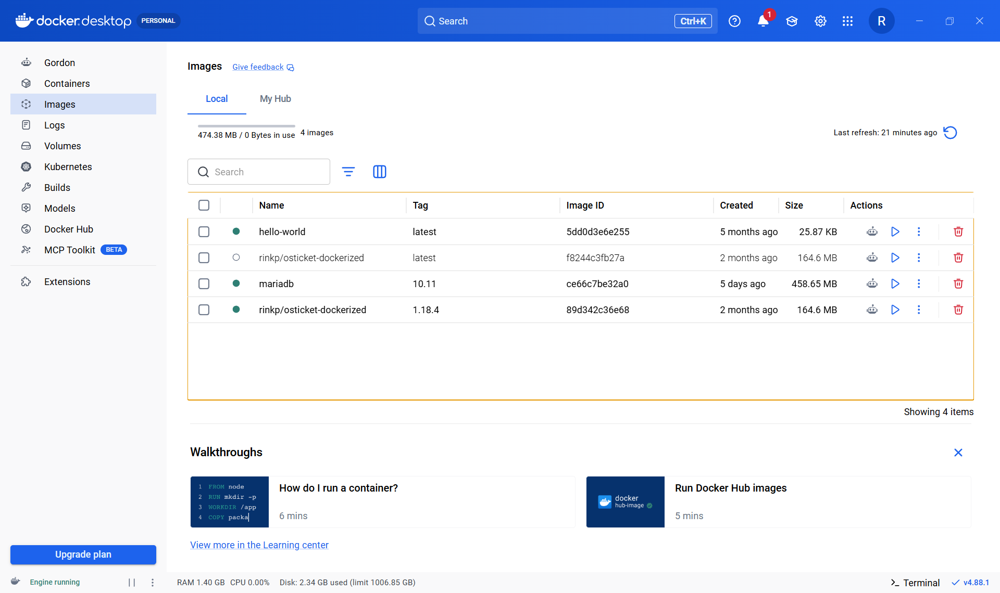

---

### 3. Docker Compose Configuration

Created the Docker Compose configuration used to deploy the osTicket and MariaDB environment.

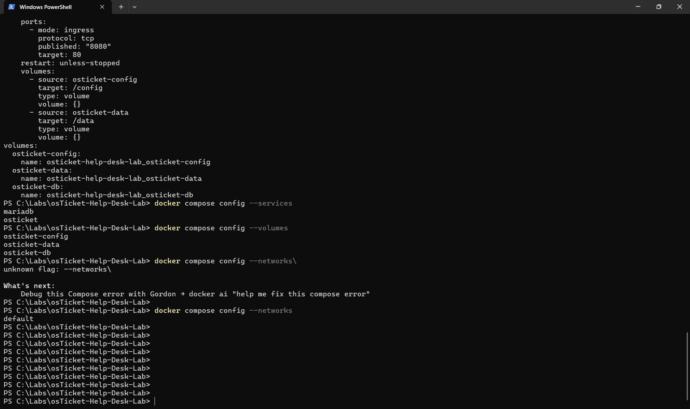

---

### 4. Containers Running

Verified that the required Docker containers were running successfully.

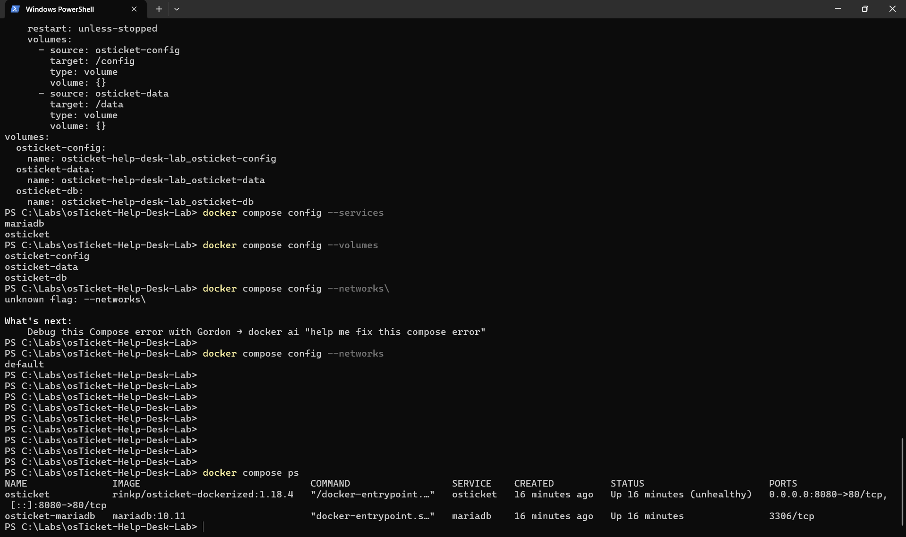

---

### 5. osTicket Dashboard

Verified successful deployment and access to the osTicket Service Desk.

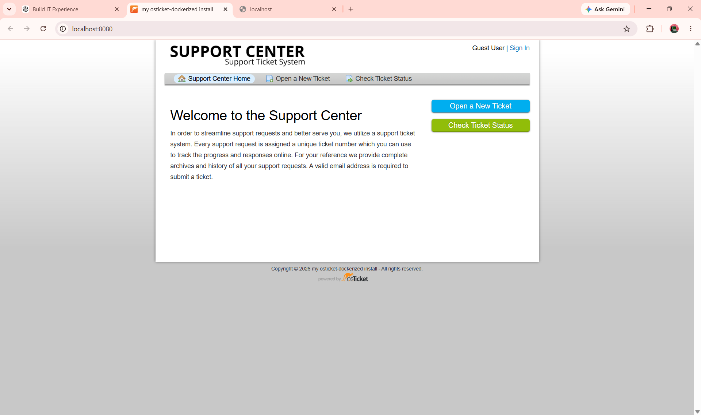

---

### Phase 1 Result

Successfully deployed a local osTicket environment with MariaDB using Docker Compose and verified application availability.

---

# Phase 2 — osTicket Administration & Configuration

Configured the Service Desk structure required to support realistic incident management.

### 6. Admin System Settings

Configured the primary osTicket system settings.

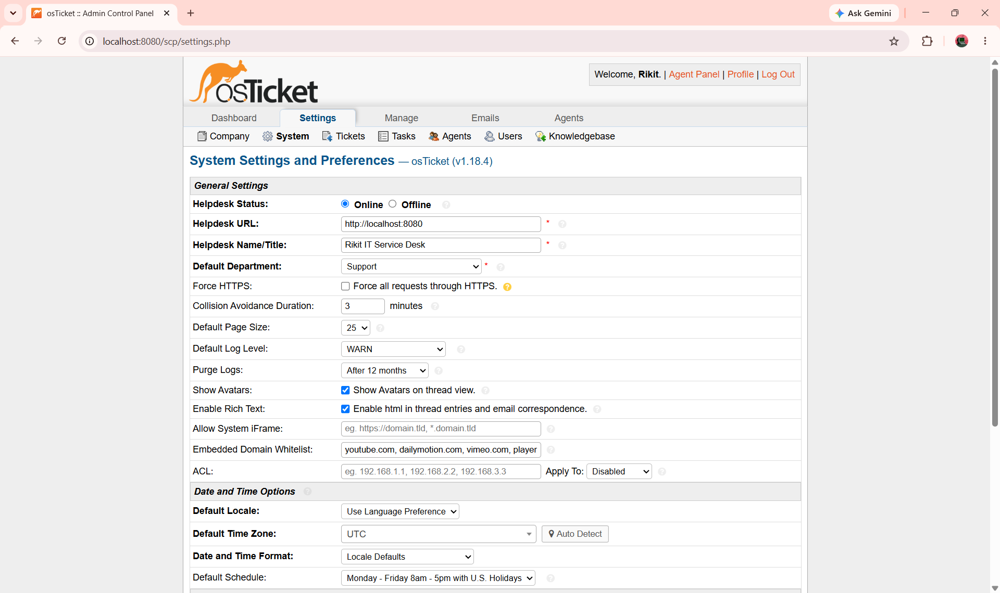

---

### 7. Departments

Configured the departments used to organize Service Desk support.

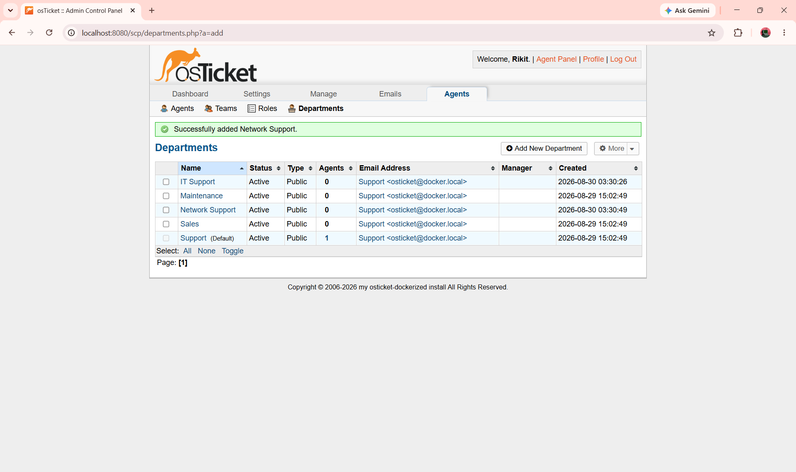

---

### 8. Help Topics

Configured help topics to categorize incoming incidents.

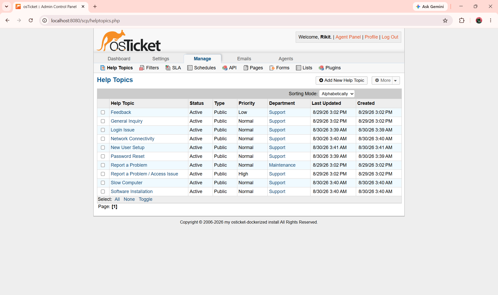

---

### 9. IT Support Team

Configured the Level I IT Support team and assigned the appropriate support agent.

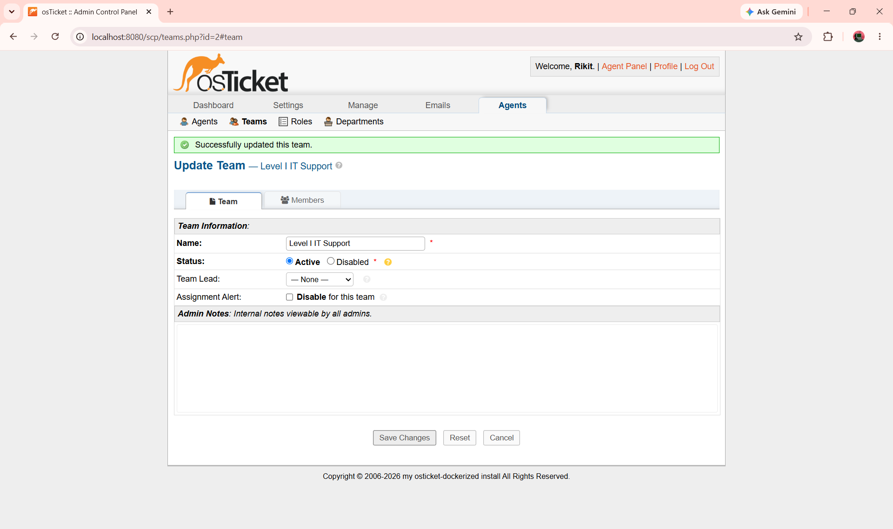

---

### 10. Test User

Created a simulated end user for testing the Service Desk workflow.

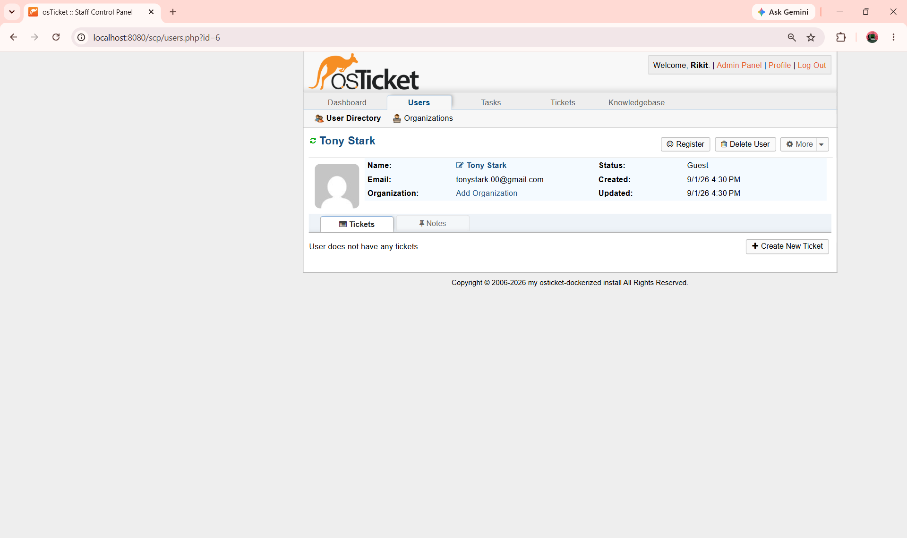

---

### Phase 2 Result

Successfully configured the osTicket Service Desk structure, including system settings, departments, help topics, support teams, agents, and a simulated end user.

---

# Phase 3 — Incident Management

Phase 3 demonstrates a realistic **Level 1 IT Service Desk incident management workflow** using the configured osTicket environment.

Each incident follows a structured workflow:

> **Ticket Creation → Triage → Investigation → Troubleshooting → User Communication → Verification → Closure**

---

# 🎫 Ticket 01 — Microsoft 365 Login Issue

**Ticket:** #992553
**User:** Tony Stark
**Issue:** Unable to sign in to Microsoft 365 account
**Priority:** High
**Help Topic:** Login Issue
**Assigned To:** Rikit Thapa
**Status:** Closed

---

## 1. Ticket Created

The user reported being unable to sign in to their Microsoft 365 account.

The incident was submitted through the osTicket web portal and entered into the Service Desk queue.


**Service Desk actions demonstrated:**

* Captured the user's issue
* Identified the affected service
* Identified the end user
* Created the incident ticket
* Started the incident management process

---

## 2. Ticket Triage

The ticket was reviewed and assessed by the Service Desk agent.

The incident was categorized as a **Login Issue**, assigned to **Rikit Thapa**, and given a **High** priority.

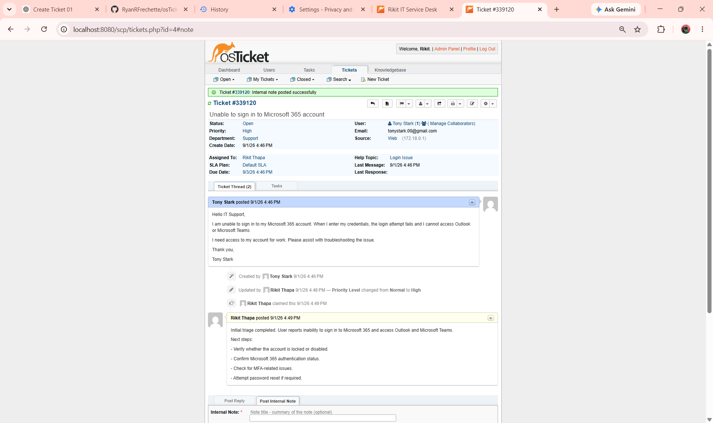

**Service Desk actions demonstrated:**

* Reviewed the reported issue
* Categorized the incident
* Assessed priority
* Assigned the ticket
* Prepared the incident for troubleshooting

---

## 3. Internal Troubleshooting Note

An internal note was added to document the investigation and troubleshooting performed by the support agent.

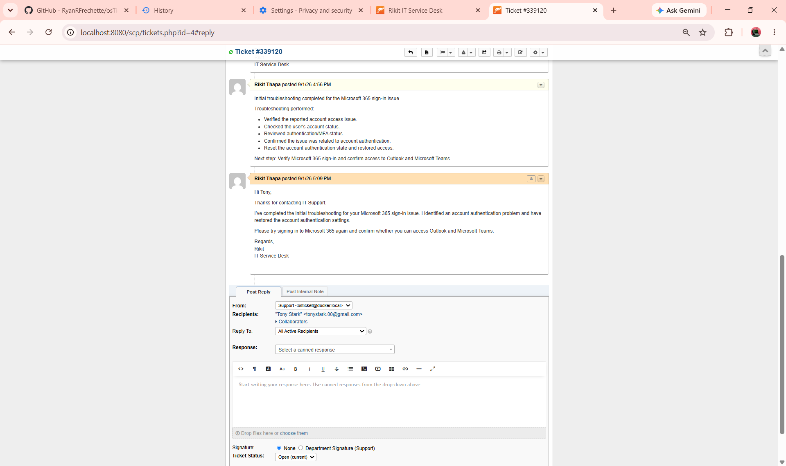

**Documentation demonstrated:**

* Troubleshooting notes
* Investigation details
* Internal Service Desk communication
* Technical documentation

---

## 4. Customer Communication

The user was updated through the ticket regarding the troubleshooting and resolution.


**User support demonstrated:**

* Professional communication
* Clear explanation of the issue
* Resolution communication
* User-facing documentation

---

## 5. Ticket Closed

After the incident was addressed and the required communication was completed, the ticket was closed.

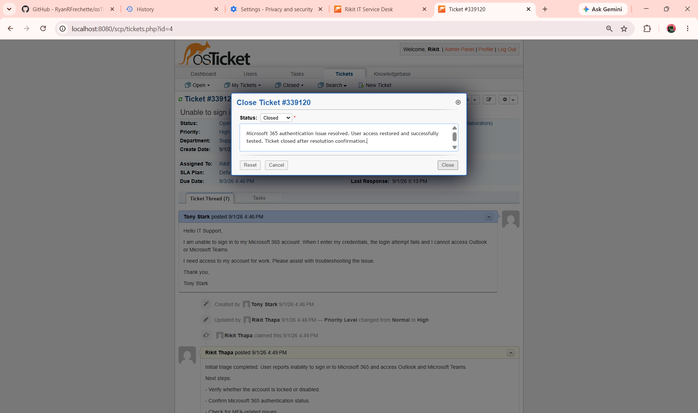

**Closure demonstrated:**

* Resolution documented
* User communication completed
* Ticket status updated
* Incident lifecycle completed

---

### Ticket 01 Result

Successfully demonstrated the complete lifecycle of a simulated Microsoft 365 authentication incident:

> **Create → Triage → Investigate → Document → Communicate → Close**

---

# 🔎 Troubleshooting Approach

Incidents are handled using a structured first-line troubleshooting methodology:

```text
Understand the Issue
        ↓
Gather Information
        ↓
Perform Initial Checks
        ↓
Isolate the Cause
        ↓
Apply the Fix
        ↓
Verify the Resolution
        ↓
Document the Work
        ↓
Escalate if Required
```

### Example Windows & Networking Tools

```text
ipconfig /all
ping
nslookup
tracert
Test-Connection
Get-Service
Get-WinEvent
```

---

# 📝 Ticket Documentation

Tickets are documented using professional Service Desk practices.

Typical documentation includes:

* User-reported issue
* Impact and priority
* Ticket categorization
* Troubleshooting performed
* Findings
* Root cause
* Resolution
* Verification
* User communication
* Internal notes
* Closure documentation

---

# 🚨 Escalation

Issues outside the scope of Level 1 support are documented and escalated appropriately.

### Network / NOC

* Network-wide outages
* VLAN or routing issues
* Switch/router problems

### Systems Administration

* Server failures
* Complex Active Directory issues
* Group Policy problems
* Privileged access requirements

### Security

* Suspected compromised accounts
* Malware incidents
* Suspicious authentication activity

---

# 🏆 Skills Demonstrated

### Service Desk

**Incident Management · Ticket Triage · Prioritization · Ticket Documentation · User Communication · Escalation**

### Technical Support

**Windows · Microsoft 365 · Account & Access · Authentication · Networking · DNS · TCP/IP · Basic PowerShell**

### Tools

**osTicket · Docker · Docker Compose · MariaDB · WSL · Git · GitHub**

---

# 📂 Repository Structure

```text
IT-Service-Desk-Incident-Management-Lab/
│
├── README.md
│
├── screenshots/
│   │
│   ├── setup/
│   │   ├── 01-docker-version.png
│   │   ├── 02-docker-hello-world.png
│   │   ├── 03-docker-compose-configuration.png
│   │   ├── 04-containers-running.png
│   │   └── 05-osticket-dashboard.png
│   │
│   ├── admin-config/
│   │   ├── 06-admin-system-settings.png
│   │   ├── 07-departments-configured.png
│   │   ├── 08-help-topics-configured.png
│   │   ├── 09-it-support-team.png
│   │   └── 10-test-user-created.png
│   │
│   └── tickets/
│       └── ticket-01/
│           ├── Phase3_Ticket01_Created.png
│           ├── Phase3_Ticket01_Triage.png
│           ├── Phase3_Ticket01_Internal_Note.png
│           ├── Phase3_Ticket01_Customer_Reply.png
│           └── Phase3_Ticket01_Closed.png
│
└── .gitignore
```

---

# 🔐 Security

This is a personal homelab and portfolio project.

* All users and incidents are simulated
* No real customer or company information is used
* Credentials and secrets are excluded from the repository
* Screenshots are reviewed before publication

---

# 💼 Career Relevance

This project demonstrates practical skills relevant to:

* **IT Support Technician**
* **Service Desk Analyst**
* **Help Desk Technician**
* **Desktop Support Technician**
* **Technical Support Specialist**
* **NOC Technician**

---

# 👤 About

**Rikit Thapa**

Computer Systems Networking Technician focused on entry-level **IT Support, Service Desk, Desktop Support, and NOC** opportunities.

### Certifications

**CCNA · Microsoft Azure Fundamentals (AZ-900) · Fortinet Certified Associate in Cybersecurity**

### Technical Focus

**Windows · Active Directory · Microsoft 365 · Networking · PowerShell · Troubleshooting · Service Desk**

---

## 🔗 Professional Links

* GitHub: https://github.com/rikit03
* Portfolio: https://rikit03.github.io/portfolio
* LinkedIn: https://linkedin.com/in/rikit-thapa-294ab028

---

Built and documented by **Rikit Thapa**

*Personal homelab and simulated IT Service Desk environment created for hands-on learning and portfolio demonstration.*
