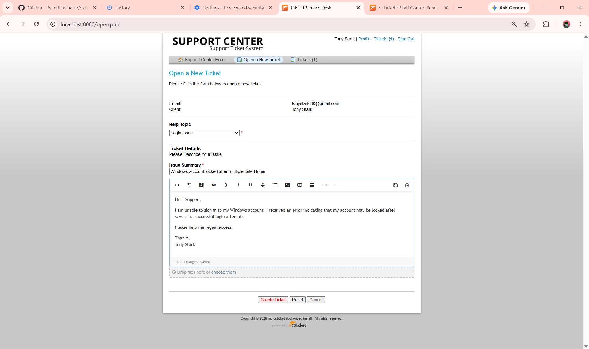
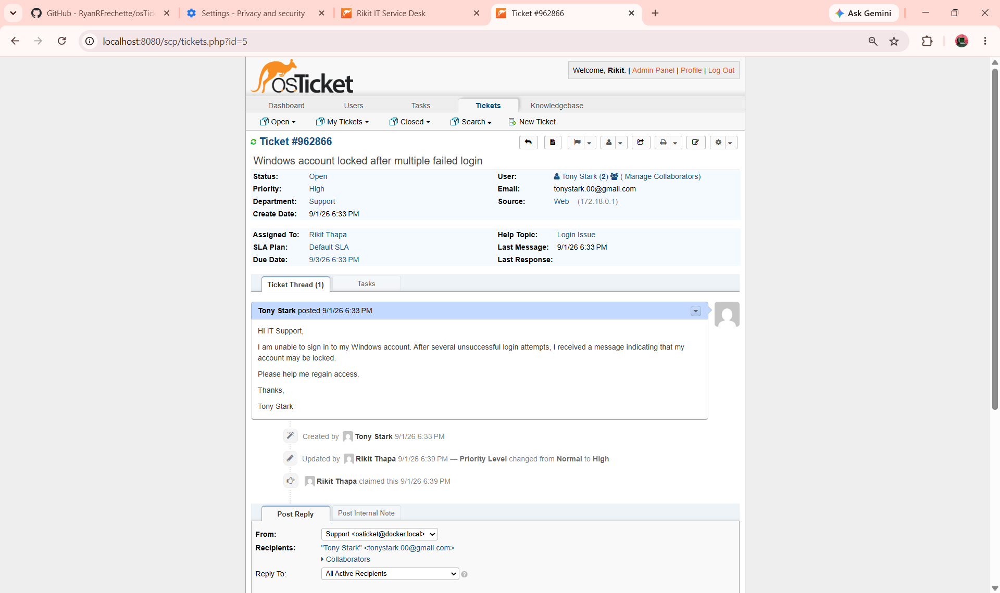
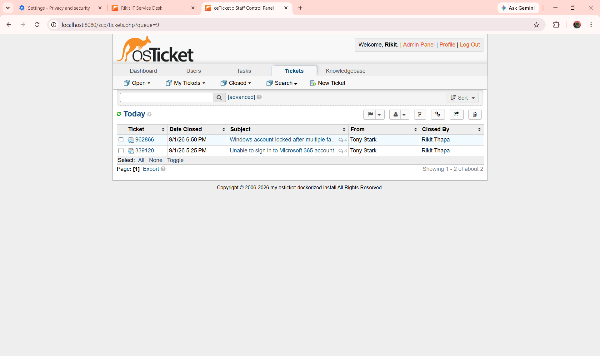
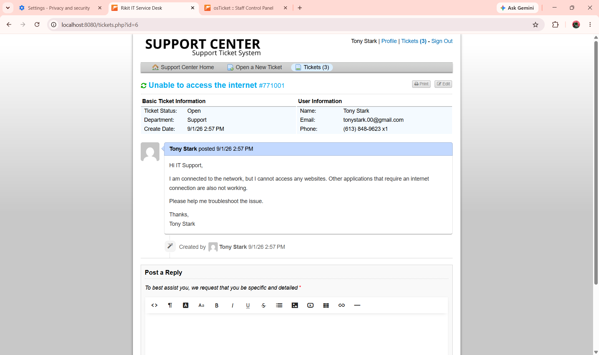
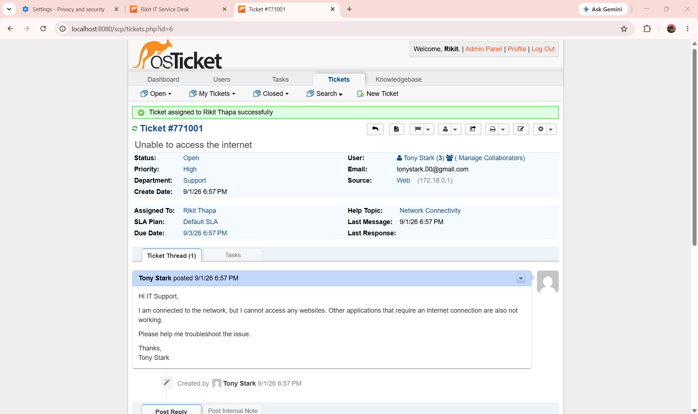
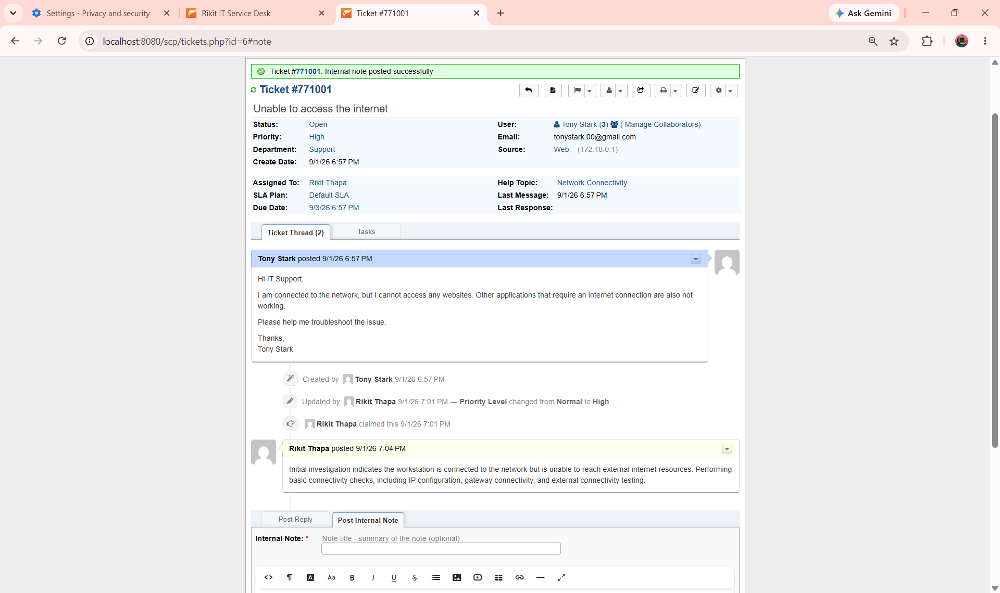
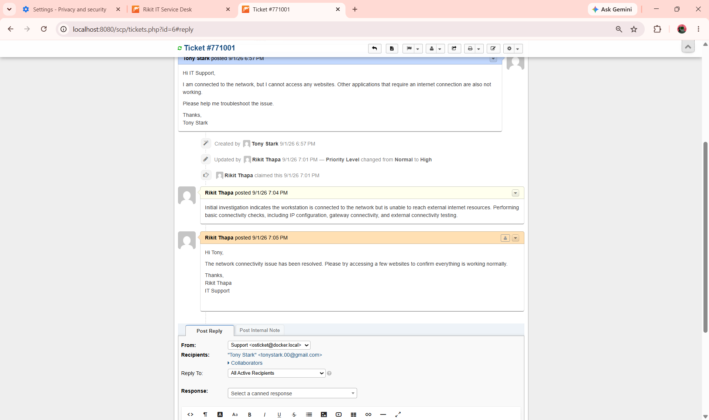
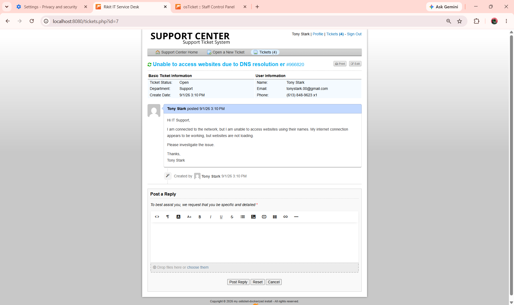
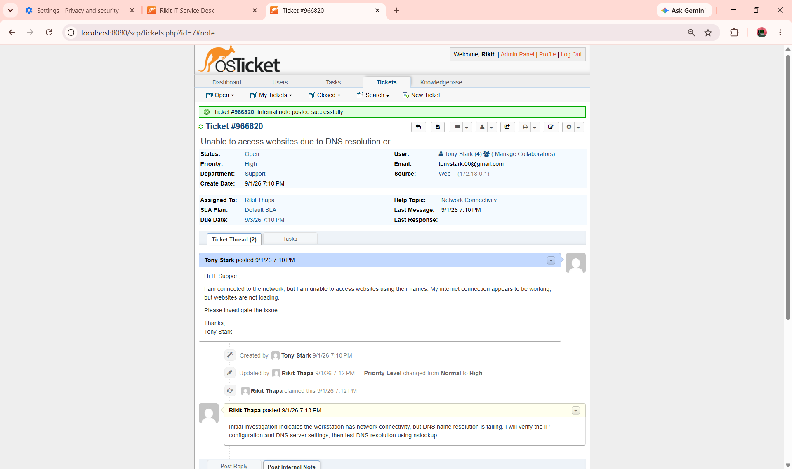
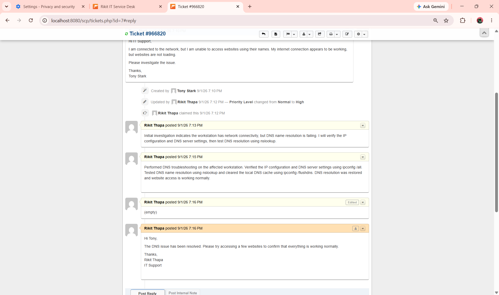

# 🎫 IT Service Desk Incident Management Lab

**osTicket · Docker · MariaDB · Windows 11 · WSL · PowerShell · Git · GitHub**

A hands-on IT Service Desk homelab designed to demonstrate practical **Level 1 IT Support, incident management, troubleshooting, documentation, and user communication skills** using a self-hosted osTicket environment.

The project simulates a real-world Service Desk workflow:

> **Identify → Investigate → Troubleshoot → Resolve → Verify → Document → Close**

---

## 🎯 Project Objectives

* Deploy and configure a functional osTicket Service Desk
* Configure departments, help topics, support teams, agents, and users
* Simulate realistic IT support incidents
* Practice ticket triage and prioritization
* Perform structured first-line troubleshooting
* Document investigation and resolution steps
* Demonstrate professional user communication
* Practice incident verification and closure
* Maintain technical documentation using Git and GitHub

---

# 🛠️ Lab Environment

| Component         | Technology              |
| ----------------- | ----------------------- |
| Host OS           | Windows 11              |
| Ticketing System  | osTicket 1.18.4         |
| Deployment        | Docker / Docker Compose |
| Database          | MariaDB 10.11           |
| Linux Environment | WSL 2 / Ubuntu          |
| Scripting         | PowerShell              |
| Version Control   | Git / GitHub            |

---

# 🚀 Phase 1 — Environment Setup

Built the underlying Service Desk environment using Docker and Docker Compose.

### 1. Docker Version

Verified that Docker was installed and available in the Windows environment.


### 2. Docker Hello World

Verified that Docker containers could successfully run.


### 3. Docker Compose Configuration

Created the Docker Compose configuration used to deploy the osTicket and MariaDB environment.


### 4. Containers Running

Verified that the required Docker containers were running successfully.


### 5. osTicket Dashboard

Verified successful deployment and access to the osTicket Service Desk.


### Phase 1 Result

Successfully deployed a local osTicket Service Desk environment with MariaDB using Docker Compose and verified application availability.

---

# ⚙️ Phase 2 — osTicket Administration & Configuration

Configured the Service Desk structure required to support realistic incident management.

### 6. Admin System Settings

Configured the primary osTicket system settings.


### 7. Departments

Configured departments used to organize Service Desk support.


### 8. Help Topics

Configured help topics to categorize incoming incidents.


### 9. IT Support Team

Configured the Level I IT Support team and assigned the appropriate support agent.


### 10. Test User

Created a simulated end user for testing the Service Desk workflow.


### Phase 2 Result

Successfully configured the osTicket Service Desk structure, including system settings, departments, help topics, support teams, agents, and a simulated end user.

---

# 🎫 Phase 3 — Incident Management

Phase 3 demonstrates realistic **Level 1 IT Service Desk incident management workflows**.

The first four incidents contain screenshot evidence from the osTicket environment. Additional scenarios are documented as **text-based simulated incidents** to demonstrate broader troubleshooting coverage without unnecessary screenshots.

### Standard Incident Workflow

> **Ticket Creation → Triage → Investigation → Troubleshooting → Resolution → User Communication → Verification → Closure**

---

# 🎫 Ticket 01 — Microsoft 365 Login Issue

**Ticket:** #992553
**User:** Tony Stark
**Issue:** Unable to sign in to Microsoft 365 account
**Priority:** High
**Help Topic:** Login Issue
**Department:** Support
**Assigned To:** Rikit Thapa
**Status:** Closed

### 1. Ticket Created

The user reported being unable to sign in to their Microsoft 365 account.


**Actions demonstrated:**

* Captured the user's issue
* Identified the affected service
* Identified the end user
* Created the incident ticket

### 2. Ticket Triage

The incident was categorized as a **Login Issue**, assigned to the support technician, and given a **High** priority.


**Actions demonstrated:**

* Incident categorization
* Priority assessment
* Ticket assignment
* Initial investigation

### 3. Internal Troubleshooting

Troubleshooting and investigation were documented using an internal ticket note.


### 4. Customer Communication

The user was updated through the ticket.


### 5. Ticket Closure

The resolution was documented and the incident was closed.


### Ticket 01 Result

Successfully demonstrated the complete lifecycle of a simulated Microsoft 365 authentication incident.

> **Create → Triage → Investigate → Resolve → Communicate → Close**

---

# 🎫 Ticket 02 — Windows Account Lockout

**User:** Tony Stark
**Issue:** Windows account locked after multiple failed login attempts
**Priority:** High
**Help Topic:** Login Issue
**Department:** Support
**Assigned To:** Rikit Thapa
**Status:** Closed

### 1. Ticket Created

The user reported being unable to sign in to their Windows account.



### 2. Ticket Triage

The incident was categorized as a **Login Issue**, prioritized, and assigned to the support technician.



### 3. Internal Troubleshooting

The investigation and account-access troubleshooting were documented in an internal note.


### 4. Customer Communication

The user was informed that the account-access issue had been resolved.


### 5. Ticket Closure

The resolution was documented and the ticket was closed.



### Ticket 02 Result

Successfully demonstrated a simulated Windows account lockout incident from creation through investigation, resolution, communication, and closure.

---

# 🎫 Ticket 03 — Network Connectivity Issue

**User:** Tony Stark
**Issue:** Unable to access the internet
**Priority:** Medium
**Help Topic:** Network Issue
**Department:** Support
**Assigned To:** Rikit Thapa
**Status:** Closed

### 1. Ticket Created

The customer reported that the workstation was connected to the network but unable to access websites.



### 2. Ticket Triage

The incident was reviewed, prioritized, categorized, and assigned for investigation.



### 3. Internal Troubleshooting

Network connectivity troubleshooting was documented, including IP configuration, gateway connectivity, and external connectivity checks.



### 4. Customer Communication

The customer was informed that connectivity had been restored.



### 5. Ticket Closure

The resolution was documented and the ticket was closed.


### Ticket 03 Result

Demonstrated structured first-line network troubleshooting and incident documentation.

---

# 🎫 Ticket 04 — DNS Resolution Failure

**User:** Tony Stark
**Issue:** Unable to access websites due to DNS resolution failure
**Priority:** Medium
**Help Topic:** Network Issue
**Department:** Support
**Assigned To:** Rikit Thapa
**Status:** Closed

### 1. Ticket Created

The customer reported that the network connection appeared to be working, but websites were not loading by name.



### 2. Ticket Triage

The incident was reviewed and assigned to IT Support for DNS and network troubleshooting.



### 3. Customer Communication

The customer was informed that the DNS issue had been resolved and was asked to verify website access.



### 4. Ticket Closure

The resolution was documented and the ticket was closed after verification.


### Ticket 04 Result

Demonstrated basic DNS troubleshooting, user communication, verification, and ticket closure.

---

# 🧪 Additional Simulated Incidents

The following incidents are **text-based simulated scenarios** designed to demonstrate broader Level 1 troubleshooting knowledge. They do not contain screenshot evidence.

---

# 🎫 Ticket 05 — VPN Connection Failure

**User:** Sarah Wilson
**Issue:** Unable to connect to the company VPN
**Priority:** High
**Category:** Remote Access
**Status:** Resolved

### Investigation

* Confirmed the user had internet connectivity
* Verified VPN client was installed and running
* Checked user credentials and MFA
* Restarted the VPN client
* Verified VPN configuration
* Tested the connection again

### Resolution

The VPN client was restarted and the connection was successfully re-established.

### Skills Demonstrated

**VPN · Remote Access · MFA · Connectivity Troubleshooting · User Support**

---

# 🎫 Ticket 06 — Shared Folder Access Denied

**User:** John Smith
**Issue:** Unable to access a departmental shared folder
**Priority:** Medium
**Category:** Access & Permissions
**Status:** Resolved

### Investigation

* Confirmed the user could access other network resources
* Verified the shared folder path
* Checked the user's assigned permissions
* Confirmed the appropriate security group membership
* Tested access after the permission update

### Resolution

The required access permission was restored and the user successfully accessed the shared folder.

### Skills Demonstrated

**Windows Permissions · File Shares · Access Control · Active Directory · Troubleshooting**

---

# 🎫 Ticket 07 — Printer Not Printing

**User:** Emily Johnson
**Issue:** Windows workstation unable to print to the office printer
**Priority:** Medium
**Category:** Hardware / Printing
**Status:** Resolved

### Investigation

* Confirmed the printer was powered on
* Checked the workstation's printer connection
* Verified the correct default printer
* Checked the print queue
* Restarted the Print Spooler service
* Sent a test print

### Resolution

The print queue was cleared and the Print Spooler service was restarted. A test page printed successfully.

### Skills Demonstrated

**Windows · Printer Troubleshooting · Print Spooler · Hardware Support · User Communication**

---

# 🎫 Ticket 08 — Outlook Email Issue

**User:** Michael Brown
**Issue:** Outlook unable to send and receive email
**Priority:** Medium
**Category:** Microsoft 365
**Status:** Resolved

### Investigation

* Confirmed network connectivity
* Verified Microsoft 365 account authentication
* Checked Outlook connection status
* Restarted Outlook
* Verified mailbox synchronization
* Tested sending and receiving email

### Resolution

Outlook successfully reconnected to the Microsoft 365 mailbox and email functionality was restored.

### Skills Demonstrated

**Microsoft 365 · Outlook · Authentication · Connectivity · Application Troubleshooting**

---

# 🔎 Troubleshooting Approach

Incidents are handled using a structured first-line troubleshooting methodology:

```text
Understand the Issue
        ↓
Gather Information
        ↓
Perform Initial Checks
        ↓
Isolate the Cause
        ↓
Apply the Fix
        ↓
Verify the Resolution
        ↓
Document the Work
        ↓
Escalate if Required
```

### Example Windows & Networking Tools

```text
ipconfig /all
ipconfig /flushdns
ping
nslookup
tracert
Test-Connection
Get-Service
Get-WinEvent
```

---

# 📝 Ticket Documentation Standards

Tickets are documented using professional Service Desk practices.

Typical documentation includes:

* User-reported issue
* Affected service or device
* Impact and priority
* Ticket categorization
* Initial investigation
* Troubleshooting performed
* Findings
* Resolution
* Verification
* User communication
* Internal notes
* Closure documentation

---

# 🚨 Escalation

Issues outside the scope of Level 1 support are documented and escalated appropriately.

### Network / NOC

* Network-wide outages
* VLAN or routing issues
* Switch or router failures
* Infrastructure connectivity problems

### Systems Administration

* Server failures
* Complex Active Directory issues
* Group Policy problems
* Privileged access requirements

### Security

* Suspected compromised accounts
* Malware incidents
* Suspicious authentication activity
* Potential security breaches

---

# 🏆 Skills Demonstrated

### Service Desk

**Incident Management · Ticket Triage · Prioritization · Ticket Documentation · User Communication · Incident Closure · Escalation**

### Technical Support

**Windows · Microsoft 365 · Outlook · Account & Access · Authentication · Active Directory · Networking · DNS · TCP/IP · VPN · File Permissions · Printer Troubleshooting · PowerShell**

### Tools & Technologies

**osTicket · Docker · Docker Compose · MariaDB · WSL 2 · Ubuntu · PowerShell · Git · GitHub**

---

# 📂 Repository Structure

```text
IT-Service-Desk-Incident-Management-Lab/
│
├── README.md
│
├── screenshots/
│   │
│   ├── setup/
│   │   ├── 01-docker-version.png
│   │   ├── 02-docker-hello-world.png
│   │   ├── 03-docker-compose-configuration.png
│   │   ├── 04-containers-running.png
│   │   └── 05-osticket-dashboard.png
│   │
│   ├── admin-config/
│   │   ├── 06-admin-system-settings.png
│   │   ├── 07-departments-configured.png
│   │   ├── 08-help-topics-configured.png
│   │   ├── 09-it-support-team.png
│   │   └── 10-test-user-created.png
│   │
│   └── tickets/
│       │
│       ├── ticket-01/
│       │   ├── Phase3_Ticket01_Created.png
│       │   ├── Phase3_Ticket01_Triage.png
│       │   ├── Phase3_Ticket01_Internal_Note.png
│       │   ├── Phase3_Ticket01_Customer_Reply.png
│       │   └── Phase3_Ticket01_Closed.png
│       │
│       ├── ticket-02/
│       │   ├── Phase3_Ticket02_Created.png
│       │   ├── Phase3_Ticket02_Triage.png
│       │   ├── Phase3_Ticket02_Internal_Note.png
│       │   ├── Phase3_Ticket02_Customer_Reply.png
│       │   └── Phase3_Ticket02_Closed.png
│       │
│       ├── ticket-03/
│       │   ├── Phase3_Ticket03_Created.png
│       │   ├── Phase3_Ticket03_Triage.png
│       │   ├── Phase3_Ticket03_Internal_Note.png
│       │   ├── Phase3_Ticket03_Customer_Reply.png
│       │   └── Phase3_Ticket03_Closed.png
│       │
│       └── ticket-04/
│           ├── Phase3_Ticket04_Created.png
│           ├── Phase3_Ticket04_Triage.png
│           ├── Phase3_Ticket04_Customer_Reply.png
│           └── Phase3_Ticket04_Closed.png
│
└── .gitignore
```

---

# 🔐 Security

This is a personal homelab and portfolio project.

* All users and incidents are simulated
* No real customer or company information is used
* Credentials and secrets are excluded from the repository
* Screenshots are reviewed before publication
* No production systems are used

---

# 💼 Career Relevance

This project demonstrates practical skills relevant to:

* **IT Support Technician**
* **Service Desk Analyst**
* **Help Desk Technician**
* **Desktop Support Technician**
* **Technical Support Specialist**
* **NOC Technician**
* **IT Support Specialist**

---

# 👤 About

**Rikit Thapa**

Computer Systems Networking Technician focused on entry-level **IT Support, Service Desk, Desktop Support, and NOC** opportunities.

### Certifications

**CCNA · Microsoft Azure Fundamentals (AZ-900) · Fortinet Certified Associate in Cybersecurity**

### Technical Focus

**Windows · Active Directory · Microsoft 365 · Networking · DNS · PowerShell · Troubleshooting · Service Desk**

---

## 🔗 Professional Links

* GitHub: https://github.com/rikit03
* Portfolio: https://rikit03.github.io/portfolio
* LinkedIn: https://linkedin.com/in/rikit-thapa-294ab028

---

Built and documented by **Rikit Thapa**

*Personal homelab and simulated IT Service Desk environment created for hands-on learning and portfolio demonstration.*
