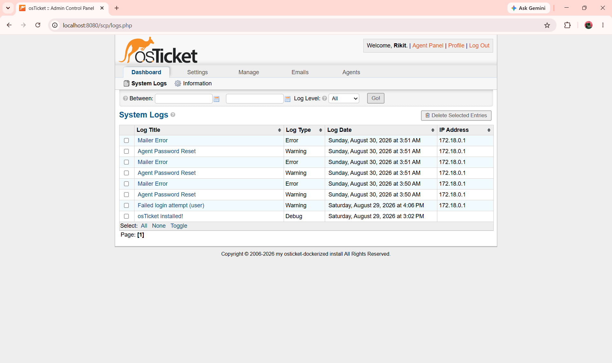
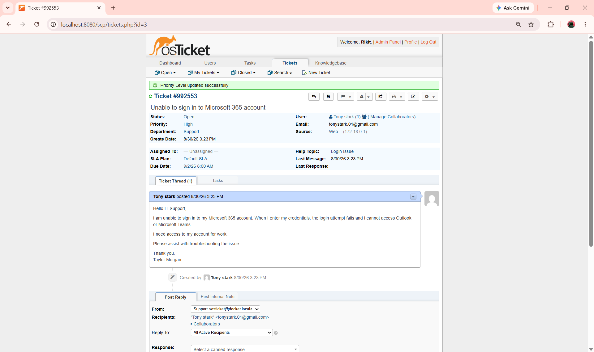
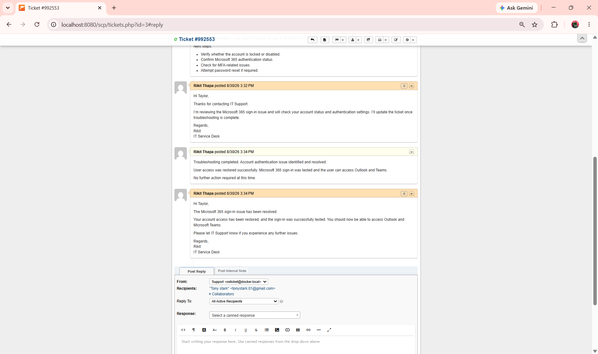

# IT Service Desk & Incident Management Lab

A hands-on IT Service Desk lab built to simulate a real-world Level 1 IT Support environment using **osTicket, Docker, WSL/Ubuntu, MariaDB, and GitHub**.

This project demonstrates practical experience with Service Desk administration, incident management, troubleshooting, customer communication, ticket documentation, resolution, and ticket closure.

---

## 🎯 Project Objectives

* Build and configure a functional IT Service Desk environment.
* Deploy and configure osTicket using Docker.
* Configure departments, Help Topics, staff/agents, priorities, SLA, and test users.
* Simulate realistic Level 1 IT support incidents.
* Document troubleshooting and customer communication.
* Demonstrate the complete incident lifecycle from creation to closure.
* Maintain technical documentation and screenshot evidence using GitHub.

---

# 🛠️ Lab Environment

| Component         | Technology              |
| ----------------- | ----------------------- |
| Host OS           | Windows 11              |
| Ticketing System  | osTicket 1.18.4         |
| Deployment        | Docker / Docker Compose |
| Database          | MariaDB 10.11           |
| Linux Environment | WSL 2 / Ubuntu          |
| Scripting         | PowerShell              |
| Version Control   | Git / GitHub            |

---

# 📁 Project Structure

```text
IT-Service-Desk-Incident-Management-Lab/
│
├── README.md
├── .gitignore
│
├── screenshots/
│   ├── setup/
│   │   ├── 01-docker-version.png
│   │   ├── 02-docker-hello-world.png
│   │   ├── 03-docker-compose-configuration.png
│   │   ├── 04-containers-running.png
│   │   └── 05-osticket-dashboard.png
│   │
│   ├── admin-config/
│   │   ├── 06-admin-system-settings.png
│   │   ├── 07-departments-configured.png
│   │   ├── 08-help-topics-configured.png
│   │   ├── 09-it-support-team.png
│   │   └── 10-test-user-created.png
│   │
│   └── tickets/
│       └── ticket-01-microsoft-365-login/
│           ├── Phase3_Ticket01_User_Creation.png
│           ├── Phase3_Ticket01_Created.png
│           ├── Phase3_Ticket01_Internal_Note.png
│           ├── Phase3_Ticket01_Customer_Reply.png
│           ├── Phase3_Ticket01_Resolution.png
│           └── Phase3_Ticket01_Closed.png
│
└── tickets/
    └── ...
```

---

# Phase 1 — Environment Setup & osTicket Deployment

## Objective

Build the technical environment required to run the IT Service Desk lab.

The environment uses Docker containers, WSL/Ubuntu, MariaDB, and osTicket.

---

## 1.1 Docker Version Verification

Docker was verified from the Windows environment to confirm that Docker was installed and available for the lab.

**Screenshot:** `01-docker-version.png`


---

## 1.2 Docker Hello World Test

A Docker Hello World container was executed to verify that Docker could successfully create and run containers.

**Screenshot:** `02-docker-hello-world.png`


---

## 1.3 Docker Compose Configuration

A Docker Compose configuration was created to define the services required for the osTicket environment, including the application and database.

**Screenshot:** `03-docker-compose-configuration.png`


---

## 1.4 Containers Running

The running Docker containers were verified to ensure that the osTicket and MariaDB services were successfully deployed.

**Screenshot:** `04-containers-running.png`


---

## 1.5 osTicket Dashboard

The osTicket dashboard was accessed successfully, confirming that the Service Desk application was installed and operational.

**Screenshot:** `05-osticket-dashboard.png`


---

# Phase 2 — osTicket Administration & Configuration

## Objective

Configure osTicket to simulate a realistic corporate IT Service Desk environment.

This phase includes system settings, departments, Help Topics, support staff, and test users.

---

## 2.1 Admin System Settings

The osTicket administration settings were configured to establish the basic Service Desk environment and ticket management behavior.

**Screenshot:** `06-admin-system-settings.png`


---

## 2.2 Departments Configured

IT Support departments were configured to organize and route incidents to the appropriate support team.

**Screenshot:** `07-departments-configured.png`


---

## 2.3 Help Topics Configured

Help Topics were configured to categorize common Service Desk requests and make ticket classification easier.

**Screenshot:** `08-help-topics-configured.png`


---

## 2.4 IT Support Team

IT Support staff/agents were configured so incidents could be assigned to the appropriate Service Desk personnel.

**Screenshot:** `09-it-support-team.png`


---

## 2.5 Test User Created

A test customer account was created to simulate an employee submitting an IT support request.

This user is used in Phase 3 for the Microsoft 365 incident scenario.

**Screenshot:** `10-test-user-created.png`


---

# Phase 3 — Incident Management

## Objective

Simulate realistic Level 1 IT Service Desk incidents using the configured osTicket environment.

Each ticket follows a complete incident lifecycle:

```text
User / Customer
      ↓
Ticket Creation
      ↓
Categorization
      ↓
Prioritization
      ↓
Investigation
      ↓
Troubleshooting
      ↓
Customer Communication
      ↓
Resolution
      ↓
Confirmation
      ↓
Ticket Closure
```

---

# 🎫 Ticket 01 — Microsoft 365 Login Issue

## Customer

**Tony Stark**

## Issue

Tony Stark reported an issue accessing his Microsoft 365 account.

## Category

**Microsoft 365 / Email**

## Priority

**High**

## Incident Type

**Account Access / Authentication**

---

## Incident Summary

Tony Stark contacted the IT Service Desk after experiencing a Microsoft 365 login issue.

The Service Desk agent created and categorized the incident, investigated the problem, documented troubleshooting actions, communicated with the customer, recorded the resolution, and closed the ticket after the issue was resolved.

---

# 📸 Ticket 01 — Evidence

All Ticket 01 screenshots are stored in:

```text
screenshots/
└── tickets/
    └── ticket-01-microsoft-365-login/
```

---

## 3.1 User Creation

Tony Stark was created as the test customer who would be used to simulate the Microsoft 365 support incident.

**Screenshot:** `Phase3_Ticket01_User_Creation.png`



---

## 3.2 Ticket Created

The Microsoft 365 login issue was submitted as a new Service Desk ticket and recorded in osTicket.

**Screenshot:** `Phase3_Ticket01_Created.png`


---

## 3.3 Internal Troubleshooting

An internal note was added to document the troubleshooting and investigation performed by the IT Support agent.

**Screenshot:** `Phase3_Ticket01_Internal_Note.png`


---

## 3.4 Customer Reply

The customer was updated during the troubleshooting process and provided with information regarding the status of the incident.

**Screenshot:** `Phase3_Ticket01_Customer_Reply.png`



---

## 3.5 Resolution

The resolution was documented after troubleshooting was completed and the Microsoft 365 access issue was resolved.

**Screenshot:** `Phase3_Ticket01_Resolution.png`


---

## 3.6 Ticket Closed

The incident was closed after the resolution was confirmed, completing the Service Desk ticket lifecycle.

**Screenshot:** `Phase3_Ticket01_Closed.png`



---

# 🔧 Incident Management Process Demonstrated

Ticket 01 demonstrates the following Service Desk activities:

### 1. User Identification

Identified the customer experiencing the issue and verified the associated support request.

### 2. Ticket Creation

Created a formal incident ticket containing the customer's issue and relevant details.

### 3. Classification

Categorized the incident under the appropriate Microsoft 365 / Email Help Topic.

### 4. Prioritization

Assigned an appropriate priority based on the impact and urgency of the access issue.

### 5. Investigation

Reviewed the ticket and investigated the reported Microsoft 365 authentication problem.

### 6. Internal Documentation

Recorded troubleshooting actions using an internal ticket note.

### 7. Customer Communication

Communicated with the customer throughout the troubleshooting process.

### 8. Resolution

Documented the successful resolution after troubleshooting was completed.

### 9. Closure

Closed the ticket after confirming that the incident had been resolved.

---

# 🧰 Skills Demonstrated

## Service Desk Skills

* Incident Management
* Ticket Lifecycle Management
* Ticket Classification
* Ticket Prioritization
* SLA Awareness
* Customer Communication
* Internal Documentation
* Incident Resolution
* Ticket Closure

## Technical Support Skills

* Microsoft 365 troubleshooting
* User account troubleshooting
* Authentication troubleshooting
* Windows troubleshooting
* Basic networking troubleshooting
* VPN troubleshooting
* Password and account support

## IT Administration

* osTicket administration
* Department configuration
* Help Topic configuration
* Staff/Agent configuration
* Priority configuration
* SLA configuration
* Test user creation

## Tools & Technologies

* osTicket 1.18.4
* Docker
* Docker Compose
* WSL 2
* Ubuntu
* MariaDB 10.11
* PowerShell
* Git
* GitHub

---

# 🔄 Real-World Service Desk Workflow

This project follows a practical Level 1 IT Service Desk workflow:

```text
Receive Incident
       ↓
Create Ticket
       ↓
Categorize
       ↓
Prioritize
       ↓
Investigate
       ↓
Troubleshoot
       ↓
Document Actions
       ↓
Communicate With User
       ↓
Resolve
       ↓
Confirm Resolution
       ↓
Close Ticket
```

---

# 🚀 Future Ticket Scenarios

Additional realistic Service Desk incidents will be added to Phase 3.

Planned scenarios include:

* **Ticket 02 — Password Reset**
* **Ticket 03 — VPN Connectivity Issue**
* **Ticket 04 — Windows Workstation Issue**
* **Ticket 05 — Software Installation Issue**
* **Ticket 06 — Network Connectivity Issue**

Each ticket will include:

* Customer/user
* Incident description
* Category
* Priority
* Investigation
* Internal notes
* Customer communication
* Troubleshooting
* Resolution
* Closure
* Screenshot evidence

---

# 📊 Project Status

| Phase                            | Status      |
| -------------------------------- | ----------- |
| Phase 1 — Environment Setup      | ✅ Completed |
| Phase 2 — osTicket Configuration | ✅ Completed |
| Phase 3 — Ticket 01              | ✅ Completed |
| Phase 3 — Tickets 02–06          | 🔄 Planned  |

---

# 🎯 Project Purpose

This project was created as a practical IT Service Desk portfolio project to demonstrate hands-on experience with:

* Service Desk operations
* Incident management
* Technical troubleshooting
* Customer support
* Ticket documentation
* User administration
* Incident resolution
* Ticket lifecycle management
* IT support processes

The lab is designed to demonstrate the practical skills expected from a **Level 1 Service Desk Analyst / IT Support Technician**.

---

## 👨‍💻 Author

**Rikit Thapa**

IT Support / Service Desk Portfolio Project

GitHub: [IT-Service-Desk-Incident-Management-Lab](https://github.com/rikit03/IT-Service-Desk-Incident-Management-Lab)

